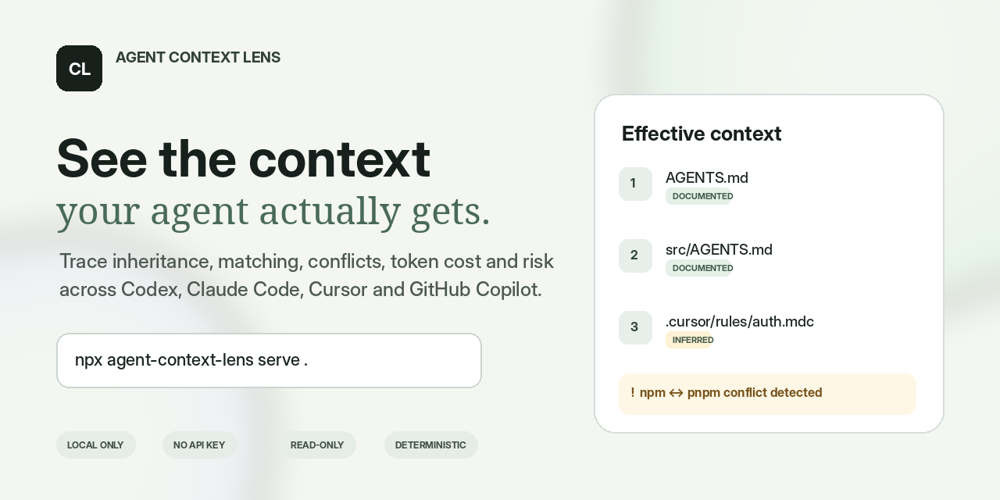

<div align="center">



# Agent Context Lens

**See exactly which repository instructions an AI coding agent receives for any file.**

Trace inheritance, path matching, conflicts, token cost, broken references, credential-like values, and risky commands across **Codex, Claude Code, Cursor, and GitHub Copilot**.

`100% local` · `No API key` · `Read-only` · `Deterministic by default`

</div>

---

## Why this exists

A modern repository may contain `AGENTS.md`, `CLAUDE.md`, `.claude/rules`, `.cursor/rules`, `.github/copilot-instructions.md`, and path-specific Copilot instructions. The hard question is not whether those files exist. It is:

> For this exact file and this exact agent, what context is actually in scope, in what order, and where does it conflict?

Agent Context Lens is the equivalent of a CSS cascade inspector for AI coding instructions.

## Install and run

```bash
npx -y agent-context-lens@0.2.0 inspect . --file src/index.ts --cwd . --agent all
npm install --global agent-context-lens@0.2.0
```

## Development

```bash
npm install
npm run build
node apps/cli/dist/index.js serve . --file src/index.ts --cwd .
```

Open the printed local URL. Nothing is uploaded.

CLI-only trace:

```bash
node apps/cli/dist/index.js inspect . --file src/index.ts --cwd . --agent all
```

JSON for automation:

```bash
node apps/cli/dist/index.js inspect . \
  --file src/index.ts \
  --cwd . \
  --copilot-surface cloud-agent \
  --agent codex,claude \
  --json \
  --output .contextlens/report.json
```

Copilot code review must be given a separately prepared PR base checkout. The scan never checks out or reads Git history itself:

```bash
contextlens inspect ./feature-worktree \
  --file src/index.ts \
  --cwd . \
  --agent copilot \
  --copilot-surface code-review \
  --copilot-base-root ../main-worktree
```

## What the report explains

- Which instruction files were detected
- Which files deterministically apply to the target file
- Load mode: startup, path match, lazy, or manual
- Ordering and effective priority
- Evidence level: verified, documented, inferred, or unknown
- Approximate instruction-token cost
- Contradictory package manager, indentation, semicolon, and quote rules
- Exact duplicates across files
- Missing path/import references
- Credential-like strings
- High-risk commands such as remote scripts piped to a shell

## Supported sources

| Agent | Sources | Evidence status |
|---|---|---|
| Codex | `AGENTS.override.md`, `AGENTS.md` | Documented |
| Claude Code | `CLAUDE.md`, `.claude/CLAUDE.md`, `CLAUDE.local.md`, `.claude/rules/**/*.md`, `@imports` | Documented |
| Cursor | `.cursor/rules/**/*.mdc`, `.cursorrules` | Inferred pending pinned runtime tests |
| GitHub Copilot | `.github/copilot-instructions.md`, `.github/instructions/**/*.instructions.md`, nearest `AGENTS.md` | Documented, surface-dependent |

See [Adapter evidence and caveats](docs/ADAPTERS.md).

## Accuracy principles

Agent behavior changes. This project does not hide that uncertainty.

1. Every source carries a confidence label.
2. Repository-local analysis excludes unobservable user and organization policy unless explicitly provided.
3. Nondeterministic semantic rule selection is shown as manual, not falsely included.
4. Analyzers report evidence and source locations; they do not claim model enforcement.
5. Adapter changes require first-party documentation or reproducible version-pinned evidence.

## Project structure

```text
apps/web       local comparison UI
apps/cli       inspect and serve commands
packages/core  adapters, resolver, analyzers, report schema
fixtures       reproducible test repositories
```

Run the intentional-conflict demo:

```bash
node apps/cli/dist/index.js serve fixtures/conflicting-rules \
  --file src/auth/login.ts \
  --cwd . \
  --no-open
```

## Security and privacy

- Read-only repository scan
- No shell execution
- No LLM or external API calls
- No telemetry
- Local loopback server
- Reports may still contain sensitive instruction text; handle exported JSON accordingly

See [SECURITY.md](SECURITY.md).

## Known limitations

- Token counts are estimates, not provider billing counts.
- Natural-language conflict detection is intentionally conservative.
- User-level and organization-managed instructions are excluded unless they are part of the scanned repository.
- Cursor agent-selected rules are nondeterministic and therefore displayed separately.
- Copilot feature support differs between IDE, chat, code review, and cloud-agent surfaces.
- Code-review reports require a caller-provided PR base checkout; generic IDE chat is not modeled.

## Contributing

Accuracy reports are especially valuable. Provide official documentation or a reproducible pinned-version trace. See [CONTRIBUTING.md](CONTRIBUTING.md).

## License

MIT
